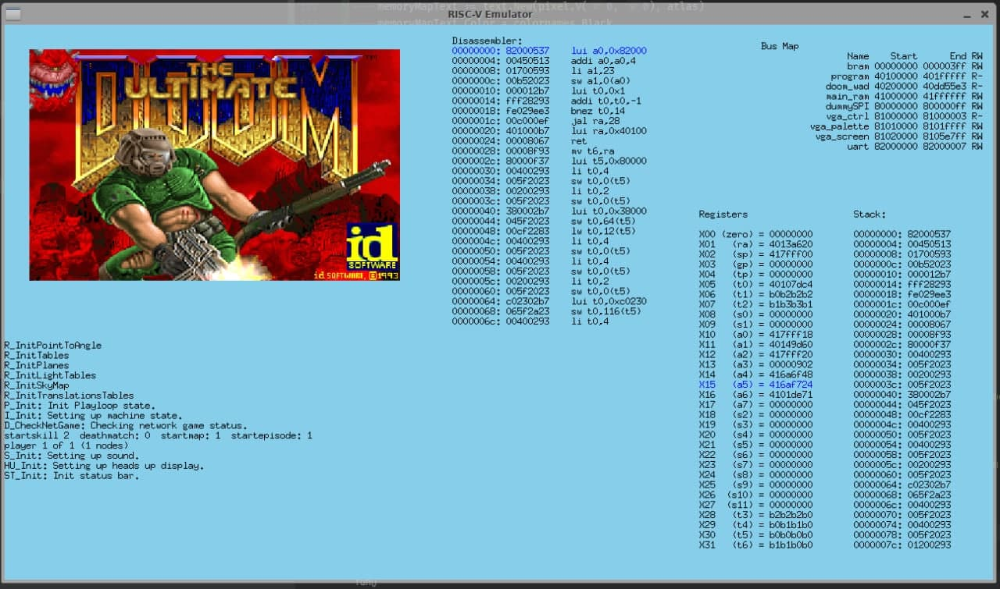

# RISC-V Emulator
A toy Golang RISC-V emulator that can play [DOOM](https://github.com/smunaut/doom_riscv)

For now it uses [smunaut](https://github.com/smunaut) [bootloader](https://github.com/smunaut/ice40-playground/tree/master/projects/riscv_doom) and [riscv_doom](https://github.com/smunaut/doom_riscv) from the ICE40 project.

But since there is no M extensions on this emulator, the `CFLAGS` in makefiles should be changed to use the non-M version

```makefile
CFLAGS=CFLAGS=-Wall -march=rv32i -mabi=ilp32 (...)
```

The emulator is made to be used headless synchronously or assyncronously and easy to make new peripherials for it. I still need to do some documentation but you can see the doom example at `cmd/ui`.



When starting the UI mode, the following keyboard keys controls the flow:

* `C` => Continue emulation
* `P` => Pause emulation
* `S` => Step instruction
